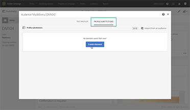
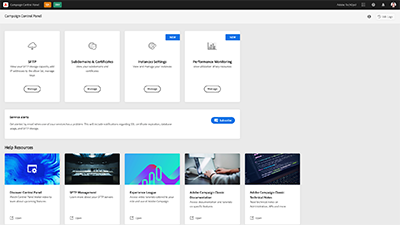
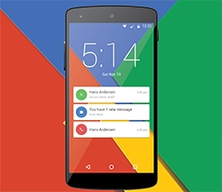

# Tutoriales de Adobe Campaign Standard

Adobe Campaign ofrece una plataforma para diseñar experiencias en canales múltiples para los clientes y proporciona un entorno para la orquestación visual de la campaña, la administración de interacciones en tiempo real y la ejecución en canales múltiples. Esta guía del usuario contiene vídeos y tutoriales sobre las numerosas funciones y funcionalidades de Adobe Campaign Standard.

## Selección de personal

<table>
<tr>
  <td>
    
    

      <a href="./communication-channels/email/profile-substitution.md">
    <strong>Sustitución de perfiles: prueba de mensajes de correo electrónico con perfiles de destino (vídeo)</strong>
    </a>
    

    

    <em>Obtenga información sobre cómo enviar una prueba para su revisión con la representación exacta del mensaje que recibirá el perfil.</em>
    

  </td>
   <td>
    
    

    <a href="https://experienceleague.adobe.com/docs/control-panel-learn/tutorials/control-panel-overview.html?lang=es">
    <strong>Panel de control (vídeos)</strong>
    </a>
    

    

    <em> Aumente su eficacia como administrador al administrar la configuración y haciendo un seguimiento de los usos de las instancias con el Panel de control.</em>
    

  </td>
  <td>
    
    

      <a href="https://experienceleague.adobe.com/docs/campaign-standard-learn/getting-started-with-push-notifications-android/introduction.html?lang=es">
    <strong>Tutorial: Introducción a las notificaciones push para Android™</strong>
    </a>
    

    

    <em>Este tutorial le guía por los pasos necesarios para enviar notificaciones push desde Adobe Campaign y recibir estas notificaciones en la aplicación de Android™. </em>
    

  </td>
</tr>
</table>

