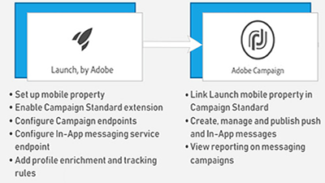

# Información general

Adobe Campaign ofrece una plataforma para diseñar experiencias multicanal para los clientes y proporciona un entorno para la organización visual de la campaña, la administración de interacciones en tiempo real y la ejecución multicanal. Esta guía del usuario contiene vídeos y tutoriales sobre las numerosas funciones y funciones de Adobe Campaign Standard.

## Novedades

* **[Actividad de API externa](/help/managing-processes-and-data/data-management-activities/external-api-activity.md)**    
   *Obtenga información sobre cómo configurar y ejecutar un flujo de trabajo con la actividad de API externa.*

* **[Sustitución de Perfiles: prueba de mensajes de correo electrónico con perfiles objetivo](/help/communication-channels/email/profile-substitution.md)**    
   *Obtenga información sobre cómo enviar una prueba para su revisión con la representación exacta del mensaje que recibirá el perfil.*

* **[Panel de control - Administración de registros TXT de Google](/help/administrating/control-panel/google-txt-record-management.md)**    
   *Obtenga información sobre cómo agregar el registro de verificación del sitio TXT de Google a todos los subdominios utilizados para enviar correos electrónicos a direcciones GMAIL a través del Panel de control de Campañas.*

* **[Tutorial: Introducción a las notificaciones push para Android](https://docs.adobe.com/content/help/en/campaign-standard-learn/getting-started-with-push-notifications-android/introduction.html)**    
   *Este tutorial le guía por los pasos necesarios para enviar notificaciones push desde Adobe Campaign y recibir estas notificaciones en la aplicación de Android.*

## Selección de personal

<table>
<tr>
  <td>
    
    

      <a href="./communication-channels/mobile/in-app/in-app-message-overview.md">
    <strong>Mensajería en la aplicación (tutorial)</strong>
    </a>
    

    

    <em>La mensajería en la aplicación es un canal que permite mostrar un mensaje cuando el usuario está activo en una aplicación móvil.</em>
    

  </td>
   <td>
    
    

      <a href="./designing-content/email-designer/email-designer-overview.md">
    <strong>Diseñador de correo electrónico (vídeos)</strong>
    </a>
    

    

    <em>El Diseñador de correo electrónico permite la creación visual rápida y sencilla de correos electrónicos personalizados individualmente.</em>
    

  </td>
  <td>
    
    

      <a href="./designing-content/product-listings-in-transactional-email.md">
    <strong>Listados de productos (tutorial)</strong>
    </a>
    

    

    <em>Cree correos electrónicos transaccionales con una lista de productos y ofertas. </em>
    

  </td>
</tr>
</table>

## Recursos adicionales

* [Documentación](https://docs.adobe.com/content/help/es-ES/campaign-standard/using/campaign-standard-home.html)
